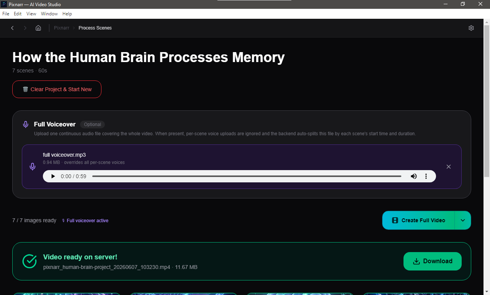

<div align="center">

# 📽️ Pixnarr

### AI-Powered Video Creation Studio

**Turn any script into a cinematic video — no editing skills required.**

[](https://github.com/vyixor/pixnarr/releases/latest)
[](LICENSE)
[](https://github.com/vyixor/pixnarr/releases/latest)
[](https://python.org)
[](https://nextjs.org)

[**Download App**](#-download) · [**Features**](#-features) · [**Setup (Dev)**](#-developer-setup) · [**API Keys**](#-getting-your-api-keys)

---



</div>

---

## ✨ Features

- 🎬 **AI Scene Generation** — paste a script, get a full structured video project with scenes, voiceover text, timing, and image prompts
- 🖼️ **AI Image Generation** — each scene gets its own cinematic image via Cloudflare Workers AI (Dreamshaper 8 LCM)
- 🎙️ **Voiceover Support** — upload per-scene audio or one full voiceover that auto-splits by scene timing
- 🎵 **Background Music** — choose from the built-in library or upload your own track
- 🎞️ **Video Rendering** — FFmpeg assembles all scenes with animations (zoom, pan, ken burns), transitions, and audio
- ✂️ **Scene Export** — export each scene as its own individual video for use in external editors
- 🖼️ **Gallery** — all generated images saved locally for reuse across projects
- 🎧 **Audio Library** — downloaded tracks saved locally, browsable in-app
- ⚙️ **Settings** — API keys, ports, and startup timeout all configurable from inside the app
- 🖥️ **Desktop App** — runs fully offline after setup, no cloud subscription, no monthly fee

---

## 📥 Download

> **Windows installer is available on the [Releases page](https://github.com/vyixor/pixnarr/releases/latest).**

```
pixnarr-setup-v1.0.0.exe   ← download and double-click to install
```

No Python, no Node.js, no FFmpeg install required — everything is bundled.

---

## 🚀 Getting Started (App Users)

### 1. Install the app
Download `pixnarr-setup-v1.0.0.exe` from the [Releases page](https://github.com/vyixor/pixnarr/releases/latest) and run the installer.

### 2. Get your API keys
Pixnarr needs two free API keys to work. See [**Getting Your API Keys**](#-getting-your-api-keys) below.

### 3. Open Settings
Launch Pixnarr → click the **⚙ Settings** icon in the top navigation bar → enter your API keys → click **Save Settings**.

### 4. Create your first video
- Go to **Create Video**
- Paste your script
- Choose style, platform, duration, and aspect ratio
- Click **🚀 Generate Video**
- Wait for scenes to generate (~30–60 seconds)
- Review and adjust scenes on the next page
- Click **🎬 Create Full Video**

Your rendered video appears with a **Download** button when complete.

---

## 🔑 Getting Your API Keys

Pixnarr uses two external AI services — both have generous free tiers.

### Groq API Key (for script-to-project generation)
Used to convert your script into a structured video project with scenes, timing, and prompts.

1. Go to [console.groq.com/keys](https://console.groq.com/keys)
2. Sign up for a free account
3. Click **Create API Key**
4. Copy the key (starts with `gsk_...`)
5. Paste into Pixnarr Settings → **Groq API Key**

**Free tier:** 14,400 requests/day on Llama 3.3 70B — more than enough for normal use.

---

### Cloudflare Workers AI Key (for image generation)
Used to generate a cinematic image for each scene.

1. Go to [dash.cloudflare.com](https://dash.cloudflare.com) and create a free account
2. Go to **AI** → **Workers AI** in the sidebar
3. Go to **Profile** → **API Tokens** → **Create Token**
4. Use the **Workers AI** template or create a custom token with `Workers AI - Run` permission
5. Copy your **Account ID** (found on the right sidebar of your dashboard)
6. Format for Pixnarr: `ACCOUNT_ID.API_TOKEN`
7. Multiple accounts can be added comma-separated: `id1.key1,id2.key2`
8. Paste into Pixnarr Settings → **Cloudflare Workers AI**

**Free tier:** 10,000 Neurons/day — approximately 100–200 images depending on model.

---

## 📁 Output Files

All generated content is saved on your machine:

| Folder | Contents |
|--------|----------|
| `C:\Users\VJ\PixNarr/rendered_videos/` | Final rendered `.mp4` videos |
| `C:\Users\VJ\PixNarr/rendered_videos/scenes/` | Per-scene videos (when using Scene Export) |
| `C:\Users\VJ\PixNarr/rendered_images/` | All AI-generated scene images |
| `C:\Users\VJ\PixNarr/rendered_audios/` | Downloaded background music tracks |

These folders are created automatically next to the backend executable when the app first runs.

---

## 🔧 Developer Setup

Want to run from source or contribute? Follow these steps.

### Prerequisites

| Tool | Version | Download |
|------|---------|----------|
| Python | 3.11 | [python.org](https://python.org) |
| Node.js | 18+ | [nodejs.org](https://nodejs.org) |
| FFmpeg | Latest | [gyan.dev/ffmpeg/builds](https://www.gyan.dev/ffmpeg/builds/) |
| Git | Any | [git-scm.com](https://git-scm.com) |

---

### Clone the repository

```bash
git clone https://github.com/vyixor/pixnarr.git
cd pixnarr
```

### Project structure

```
pixnarr/
  ├── pixlayout/          ← Next.js 16 frontend
  ├── backend/            ← FastAPI backend (Python 3.11)
  │   ├── app/
  │   │   ├── routes/     ← API route handlers
  │   │   └── main.py
  │   ├── ffmpeg_bin/     ← Place ffmpeg.exe + ffprobe.exe here
  │   ├── run_server.py
  │   └── requirements.txt
  └── electron/           ← Electron desktop shell
```

---

### Backend setup

```bash
cd backend

# Create virtual environment
python -m venv venv
venv\Scripts\activate        # Windows
# source venv/bin/activate   # Mac/Linux

# Install dependencies
pip install -r requirements.txt

# Create .env file with your API keys if you want
copy .env.example .env       # Windows
# cp .env.example .env       # Mac/Linux
```

Edit `.env`:
```env
GROQ_API_KEY=gsk_your_key_here
WORKER_AI_ACCOUNT_API=your_account_id.your_api_key
```

Or edit `preferences.conf`:
```txt
rendered_videos_path=C:\Users\YourName\PixNarr\rendered_videos
rendered_audios_path=C:\Users\YourName\PixNarr\rendered_audios
rendered_images_path=C:\Users\YourName\PixNarr\rendered_images
GROQ_API_KEY=gsk_your_key_here
WORKER_AI_ACCOUNT_API=your_account_id.your_api_key
APIPORT=8080
STARTUP_WAIT_SECONDS=90
generate_image=yes
```
`preferences.conf` is generated in the home directory on first launch <br>
windows C:\Users\YourName\PixNarr <br>
macOS: /Users/YourName/PixNarr <br>
Linux/BSD: /home/YourName/PixNarr or /usr/home/YourName/PixNarr <br>

Place FFmpeg binaries in `backend/ffmpeg_bin/`:
- Download from [gyan.dev/ffmpeg/builds](https://www.gyan.dev/ffmpeg/builds/) → `ffmpeg-release-essentials.zip`
- Extract and copy `ffmpeg.exe` and `ffprobe.exe` into `backend/ffmpeg_bin/`

Start the backend:
```bash
uvicorn app.main:app --host 127.0.0.1 --port 8080 --reload
```

---

### Frontend setup

```bash
cd pixlayout

# Install dependencies
npm install

# Start the dev server
npm run dev
```

Frontend runs on `http://localhost:3000`

---

### Electron setup (optional — for desktop shell)

```bash
cd electron
npm install
npx electron .
```

> **Note:** For Electron dev mode, the backend and frontend must already be running in separate terminals before launching Electron.

---

### Running in dev mode (all three terminals)

**Terminal 1 — Backend:**
```bash
cd backend
venv\Scripts\activate
uvicorn app.main:app --host 127.0.0.1 --port 8080 --reload
```

**Terminal 2 — Frontend:**
```bash
cd pixlayout
npm run dev
```

**Terminal 3 — Electron (optional):**
```bash
cd electron
npx electron .
```

Or just open `http://localhost:3000` directly in your browser — the app works in-browser during development without Electron.

---

## 🏗️ Building the Desktop Installer

### Step 1 — Bundle the backend

Download FFmpeg binaries into `backend/ffmpeg_bin/` first, then:

```bash
cd backend
venv\Scripts\activate
build_backend.bat
```

Output: `backend/dist/pixnarr_backend.exe` + `backend/dist/launch_backend.bat`

> First build takes 10–20 minutes (Nuitka downloads a C compiler). Subsequent builds are faster.

### Step 2 — Bundle the frontend

```bash
cd pixlayout
npm install --save-dev cross-env
build_frontend.bat
```

Output: `pixlayout/dist/frontend/` (Next.js standalone + portable Node.js)

### Step 3 — Build the installer

```bash
cd electron
npm install
npm run build
```

Output: `dist/pixnarr Setup 1.0.0.exe`

---

## 🛠️ Tech Stack

| Layer | Technology |
|-------|-----------|
| Desktop shell | Electron 30 |
| Frontend | Next.js 16, React 19, Tailwind CSS 4 |
| Backend | FastAPI, Python 3.11, Uvicorn |
| AI — Script → Project | Groq API (Llama 3.3 70B) |
| AI — Image generation | Cloudflare Workers AI (Dreamshaper 8 LCM) |
| Video rendering | FFmpeg (bundled) |
| Backend compilation | Nuitka |
| Config storage | Plain text `preferences.conf` (`~/PixNarr/`) |

---

## ❓ FAQ

**Q: Do I need an internet connection to use Pixnarr?**
A: Only for AI generation (script → project, image generation, music download). Video rendering, browsing your gallery, and playing back videos all work offline.

**Q: Where are my API keys stored?**
A: Locally on your machine at `C:\Users\YourName\PixNarr\preferences.conf` — a plain text file. Keys are never sent to any server other than Groq and Cloudflare directly from your machine.

**Q: Can I use my own images instead of AI-generated ones?**
A: Yes — open any scene's edit panel and click **Upload Image** to replace the generated image with your own.

**Q: Can I stop pixnar from autogenerating images?**
A: Yes — edit the preferences.conf file and set **generate_image** to `no` to stop PixNarr from generating the images.

**Q: Can I use my own voiceover instead of uploading per-scene audio?**
A: Yes — on the scene processing page, upload a single full voiceover audio file. The app automatically splits it by scene timing.

**Q: The app says "did not start in time" on launch.**
A: Go to **Settings** → increase **Startup Wait Time** to 120 or 180 seconds. This is common on first launch because the backend extracts its files to cache.

**Q: Can I run multiple Cloudflare accounts for more image quota?**
A: Yes — enter them comma-separated in Settings: `id1.key1,id2.key2,id3.key3`. The app cycles through them automatically.

**Q: Is there a Mac or Linux version?**
A: Not yet — Windows only for now. Mac and Linux builds are planned.

---

## 🤝 Contributing

Contributions are welcome.

1. Fork the repository
2. Create a feature branch: `git checkout -b feature/your-feature`
3. Commit your changes: `git commit -m 'Add your feature'`
4. Push to the branch: `git push origin feature/your-feature`
5. Open a Pull Request

Please open an issue first for major changes so we can discuss the approach.

---

## 📄 License

MIT License — see [LICENSE](LICENSE) for details.

---

<div align="center">

Made with ❤️ · [Report a Bug](https://github.com/vyixor/pixnarr/issues) · [Request a Feature](https://github.com/vyixor/pixnarr/issues)

</div>
